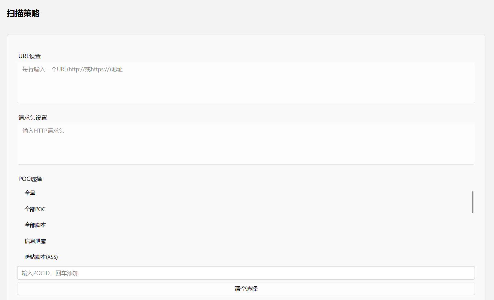
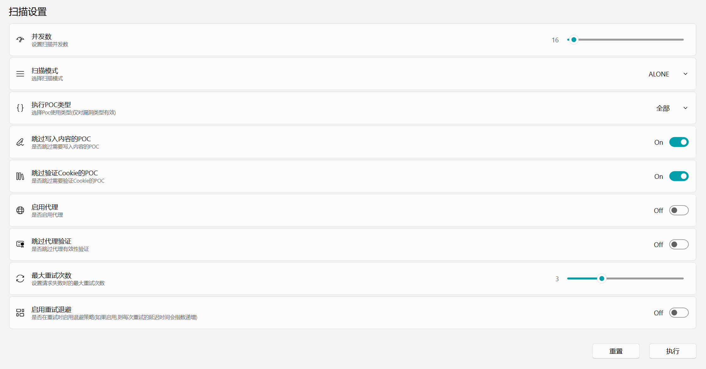
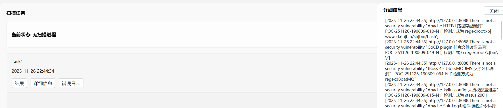

<p align="center">
  
</p>
  <h1 align="center">
 NyaSCAN - Web漏洞扫描器
</h1>

**NyaSCAN** 是一个页面简洁干净的图形化漏洞扫描/检测工具，用于Web安全和Python的学习交流。

该项目基于`Python 3.12`+`PySide6`+`QFluentWidgets`+`SQLite`。


## ✨ 核心特性

- **简洁的图形化操作**
- **可以对大多数 Web 漏洞检测**
- **基于协程的高并发扫描**
- **支持用户编写漏洞检测信息和脚本**
- **支持代理及代理轮换**
- *~~以非图形化执行(未完善/不推荐)~~*

## 🚀 快速开始

### 环境要求

- Python 3.12 或更高版本

### 安装步骤

1. **下载源码**

2. **安装依赖**

   ```
   pip install -r requirements.txt
   ```

### 基本使用

命令行启动GUI界面

```
python NyaScanGUI.py
# 有些日志会在终端输出
```

填写扫描策略界面对应内容，然后点击执行即可扫描。





结果



## 📖 详细说明

### 介绍

1. **扫描模式**

   a. **ALONE** 指一个URL执行完所有POC后再去执行下个URL

   b. **GROUP** 指一个POC执行完所有URL后再去执行下个POC
        在该模式下，启动的并发数为URL数量，若大于并发设置则按照并发数执行，若小于则依据URL数启动并发

2. **POC类型**

   指在选择漏洞类型时，选择是否需要使用脚本执行

3. **跳过写入内容的POC**

   指会对目标造成影响的POC。如生成文件、影响目标系统正常执行。

4. **最大重试次数**

   在请求目标URL发生错误时设置重试次数。默认配置在`config/global_cfg.yaml`
   文件可以配置一些重试参数，如重试状态码...

5. **启用退避**

   在重试时使用退避策略，防止瞬时并发过高对目标造成影响。若启用，等待时间则是指数增长依据最大重试次数来等待的。默认配置在`config/global_cfg.yaml`

6. **代理地址**

   全局配置，在代理界面设置。

   输入一个或多个地址，若不启用轮转则默认使用第一个代理地址。若启用代理，请保证代理有效，或能够支持并发。配置文件在`config/proxy.json`

7. **代理轮转**

   全局配置，在代理界面设置。

   若选择启用，则是每个并发批次切换一次代理。默认配置在`config/proxy.json`

⚠️以上所有配置在使用脚本进行扫描时，无法生效。使用脚本并未设计对应逻辑，而是动态导入该脚本模块去执行，完全依据脚本编写的逻辑！

脚本编写模板在**`编辑Python`**菜单中提供

### 扫描策略参数

| 字段                 | 类型 | 描述                     | 示例                                 |
| :------------------- | :--- | :----------------------- | :----------------------------------- |
| urls                 | list | 字符串形式的目标地址列表 | `['http://xx.com',"https://xx.com"]` |
| headers              | list | 字符串形式的请求行列表   |                                      |
| selected_pocs        | list | 选择POC类型列表          | `["全量"]`                           |
| concurrency          | int  | 并发数                   |                                      |
| mode                 | str  | 扫描模式ALONE和GROUP两种 | `'ALONE'`                            |
| use_poc_script       | bool | 是否使用添加脚本扫描     |                                      |
| skip_write_content   | bool | 是否跳过写入内容的POC    |                                      |
| skip_verify_cookie   | bool | 是否跳过验证cookie的POC  |                                      |
| enable_proxy         | bool | 是否启用代理             |                                      |
| max_retries          | int  | 最大重试次数             |                                      |
| enable_retry_backoff | bool | 是否启用退避策略         |                                      |


## 🗂️ 项目结构

```
VulnScanner/
├── config/                 # 配置文件目录
├── data/                   # 数据文件目录
│   ├── db/                # sqlite数据库文件
│   └── pictrue/           # 其他图片目录
│   └── script/            # 脚本目录
│   └── sql.sql			   # 数据库创建语句
├── log/                    # 日志目录
├── pageother/              # 其他实例页面目录
├── pagepoc/                # 编写漏洞信息实例页面目录
├── errorinfo.txt            # 错误信息文件
├── LICENSE.txt                 # GNU GPLv3 许可证文件
├── scan/                   # 扫描器核心目录
├── NyaScanGUI.py           # 图形化主程序入口
├── README.md               # 本文件
├── requirements.txt        # Python 依赖
└── terminal.py			    # 终端执行文件(不推荐)
```

📝 **注意事项**：若不使用GUI形式运行，则需要手动修改对应配置文件，并在 [terminal.py]() 中编写好对应字段，方可执行 [terminal.py]()。

## 📚 参见

- [QFluentWidgets](https://qfluentwidgets.com/)：QFluentWidgets是一个基于 C++ Qt/PyQt/PySide 的流畅设计组件库。
- [httpx](https://github.com/encode/httpx?tab=readme-ov-file):HTTPX 是一个功能齐全的 Python 3 HTTP 客户端库。它集成了命令行客户端，支持 HTTP/1.1 和 HTTP/2，并提供同步和异步 API。

## ⚠️ 免责声明

NyaScan 仅供**授权安全测试**和**教育学习**使用。本工具收集的漏洞信息均来源于互联网公开渠道。

⚠️ **重要提醒**：
- 未经授权对任何系统、网络或设备进行扫描属于违法行为
- 使用者需确保拥有合法权限，并自行承担全部法律责任
- 开发者及贡献者不对以下情况承担责任：
  - 任何工具误用或滥用行为
  - 因使用本工具造成的直接或间接损失
  - 任何违反法律法规的行为后果

请在使用前确保获得相关方的明确书面授权，并严格遵守当地法律法规。
